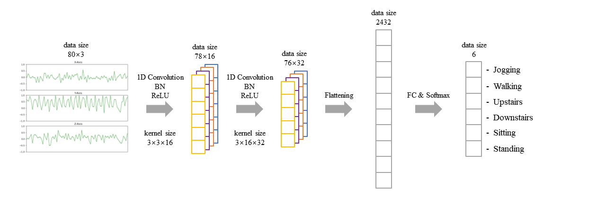
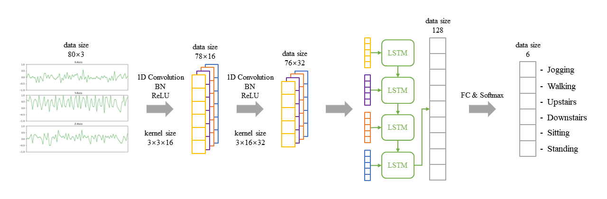
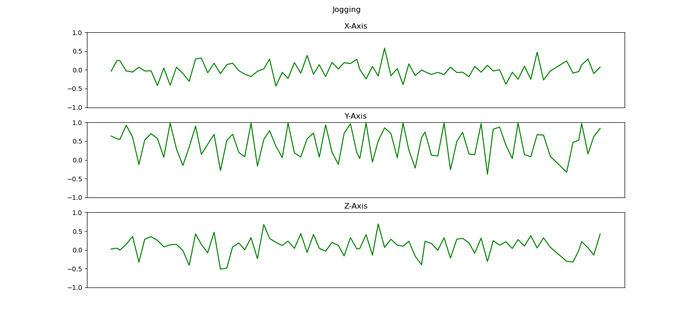
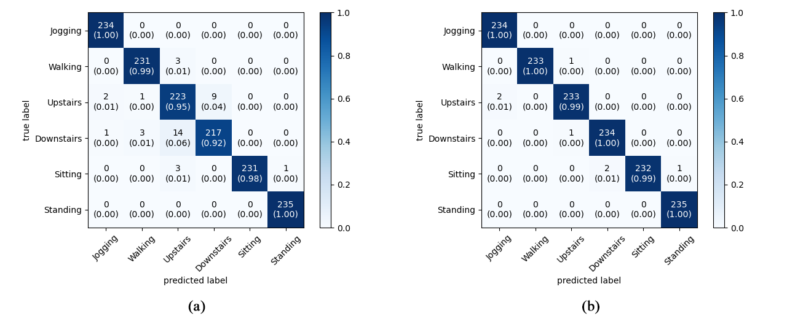

# Human Activity Recognition - WISDM's activity prediction dataset

### Model A (1D ConvNet)



### Model B (1D ConvNet + LSTM)



With a widespread of sensor-rich mobile devices, the analysis of human activities becomes more general and simpler than ever before.
In this paper, we propose two deep neural networks that efficiently and accurately perform human activity recognition (HAR) using tri-axial accelerometers.
In combination with powerful modern deep learning techniques like batch normalization and LSTM networks, our model outperforms baseline approaches and establishes state-of-the-art results on WISDM dataset.

> This research is supported by Ministry of Culture, Sports and Tourism(MCST) and Korea Creative Content Agency(KOCCA) in the Culture Technology(CT) Research & Development Program 2019.

## Quick Start

### Prerequisites

- Python 3.7
- tensorflow >= v2.2
- tensorflow-datasets
- matplotlib
- mlxtend
- numpy
- pandas
- scikit-learn

### Data Pre-processing

```bash
$ ./download_dataset.sh
$ python preprocess.py
```

### Training

To train Model A,
```bash
$ python train.py ModelA
```
To train Model B,

```bash
$ python train.py ModelB
```

Each model will be saved in `model/ModelA` and `model/ModelB` respectively.

### Evaluation

Confusion matrix is an useful way of representation to visualize the accuracy of which our model predicted on individual classes. To compute and plot a confusion matrix,

```bash
$ python test_models.py
```

or you can plot training/eval losses and accuracy over epoch using TensorBoard.

```bash
$ tensorboard --logdir=log
```

## Appendix

### Sample data (Jogging)



### Confusion matrix
- (a) Model A
- (b) Model B

